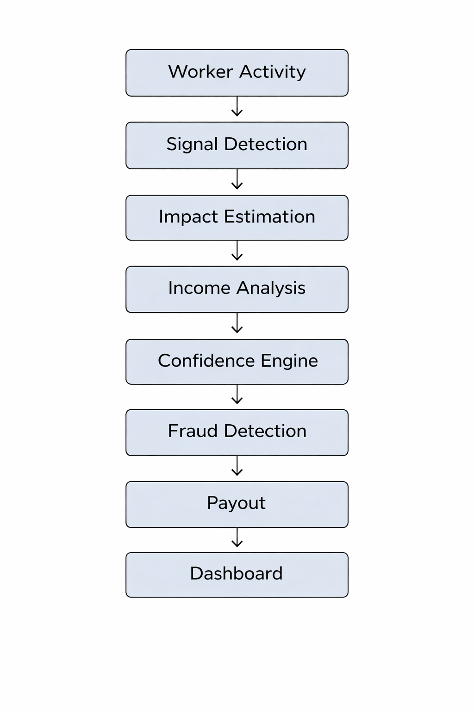

## GigShield AI  
### Adaptive Income Protection Engine for Gig Workers  

## Problem  

Gig workers lose income due to:
-  Extreme weather  
-  Low demand  
-  Mobility restrictions  

 There is **no real-time system** to:
- Detect disruptions  
- Measure actual income loss  
- Provide instant compensation  

---

## Solution  

GigShield AI is a **parametric insurance platform** that:

- Detects disruptions in real-time  
- Validates impact using multiple signals  
- Automatically triggers payouts  

 **No manual claims required**

---

## Core Innovation  

GigShield AI introduces a **multi-layer intelligence system**:

1. **Disruption Detection**  
2. **Impact Estimation**  
3. **Income Digital Twin**  
4. **Confidence Engine**  
5. **Fraud Detection (Anti-Spoofing)**  
6. **Explainable Payout System**  

---

#  Key Features  

##  Income Digital Twin
- Estimates expected income  
- Compares with actual earnings  
- Calculates real income loss  

---

##  Confidence Engine
- Validates disruption using:
  - Weather data  
  - Worker activity  
  - Location patterns  
- Ensures payout accuracy  

---

##  Hyper-Local Coverage
- Zone-level triggers  
- More precise than city-wide systems  

---

##  Protection Mode
- Warns workers before high-risk conditions  
- Activates smart coverage  

---

##  Disruption Replay
- Timeline view of:
  - Trigger  
  - Impact  
  - Payout decision  

---

#  Adversarial Defense & Anti-Spoofing Strategy  

##  Problem: GPS Spoofing  

Attackers can:
- Fake GPS location  
- Trigger false payouts  
- Exploit automated systems  

---

##  Our Solution: Multi-Signal Validation  

GigShield AI does **not rely on GPS alone**  

### Signals Used:
-  GPS trajectory (movement patterns)  
-  Device & network data  
-  Platform activity (orders, logins)  
-  Environmental correlation  
-  Cluster behavior (fraud rings)  

---

##  Fraud Detection Layers  

1. **Trajectory Analysis** → Detect unrealistic movement  
2. **Device Validation** → IP + device mismatch detection  
3. **Activity Check** → No work = suspicious claim  
4. **Cluster Detection** → Identify coordinated fraud  
5. **AI Anomaly Detection** → Fraud probability scoring  

---

##  Smart Decision Engine  

| Score | Action |
|------|-------|
| 0–29 | Auto payout ⚡ |
| 30–59 | Soft verification  |
| 60+ | Hold & review |

---

##  Fairness for Workers  

- No instant rejection  
- Transparent verification  
- Handles network issues & real disruptions  

---

# 🔄 Workflow  

#  Architecture
User → API → Signal Engine → Income Twin → Confidence Engine → Fraud Detection → Payout System

---

#  Weekly Pricing Model  

| Plan | Premium | Coverage |
|------|--------|---------|
| Basic | ₹20 | ₹500 |
| Standard | ₹30 | ₹800 |

---

#  AI Usage  

- Risk prediction  
- Income estimation  
- Anomaly detection  
- Decision scoring  

---

#  Transparency  

Every payout is fully explainable using:

- Input signals  
- Confidence score  
- Disruption timeline  

---

#  Why This Stands Out  

-  No claim process (instant payouts)  
-  Multi-signal validation (not just weather)  
-  Built-in anti-spoofing system  
-  Explainable AI decisions  
-  Designed specifically for gig workers  

---

#  Demo Video  

(Add your demo link here)

### Details Documentation

For a deeper understanding of GigShield AI:

-  **Overview & Architecture** → [View Docs](docs/README.md)  
-  **Problem Deep Dive (with Adversarial Threats)** → [Read Here](docs/03-problem-deep-dive.md)
